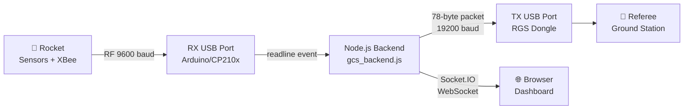
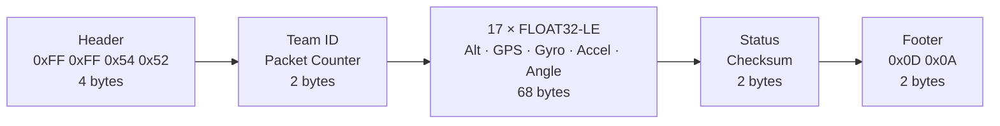
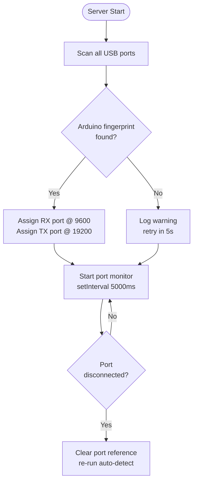

# Ground Control Station (GCS) - Team VAJRA

Welcome to the Team VAJRA Ground Control Station (GCS) software repository, developed for the TEKNOFEST A4 International Category. This software provides a robust and reliable interface to receive real-time telemetry from the rocket, visualize it on a modern dashboard, and securely relay data to the Referee Ground Station (RGS).

## 🚀 Features

- **RX Port (Data Input)**: Reliably receives standard 78-byte telemetry packets from the rocket's XBee radio system.
- **TX Port (Data Relay)**: Automatically forwards aggregated telemetry to the Referee Ground Station at the competition-required 19200 baud rate.
- **Real-Time Dashboard**: Features live visualization of altitude, trajectory, IMU data, and GPS tracking maps.
- **Dynamic Communication Modes**: Supports switching between SIMPLE, FULL, and COMMAND modes based on mission requirements.
- **Low-Latency Interface**: Utilizes WebSockets (Socket.IO) to stream data instantaneously to your local browser.

## 📋 Requirements

Ensure your system has Node.js 18+ installed. Install all dependencies using:

```bash
cd main
npm install
```
*(Dependencies: `express`, `socket.io`, `cors`, `serialport`, `@serialport/parser-readline`, `@serialport/parser-byte-length`)*

## 🔧 Quick Setup

### 1. Start the Backend Server

```bash
node main/gcs_backend.js
```

The server initializes on `http://127.0.0.1:5000` and automatically scans for connected Arduino/XBee USB ports, assigning RX at 9600 baud and TX at 19200 baud.

### 2. Launch the Dashboard

Open `main/gcs_dashboard.html` directly in your browser — no web server required.

## 🔄 Data Architecture Flow



## 🔌 Port Configuration Details

### Receiving Port (Input from Rocket)
- **Baud Rate**: 9600
- **Format**: 17 comma-separated float values, newline-delimited
- **Auto-detected**: Scans for CH340, CP210x, FTDI, PL2303 fingerprints

### Transmission Port (Output to Referee Station)
- **Target Port**: Auto-detected (typically `/dev/ttyACM0`)
- **Baud Rate**: 19200
- **Packet**: 78-byte fixed binary format
- **Modes**: SIMPLE · FULL (78 bytes) · COMMAND

### 78-Byte Packet Structure



## 🧪 Simulation and Testing

To verify the dashboard without an active rocket connection:

**Simulate incoming flight telemetry:**
```bash
node Tests/real_telemetry_simulator.js
```
*(Generates 2 minutes of synthetic flight data at 1 Hz — confirms charts, gauges, and status indicators work correctly.)*

**Test the TX relay connection:**
```bash
node Tests/test_tx_port.js
```

**Run all non-hardware tests:**
```bash
npm test
```

## 📡 API Reference

**Data Ingestion (RX)**
- `GET /api/ports` — Lists all detected USB serial ports
- `POST /api/auto-detect` — Auto-scans and connects RX + TX ports
- `POST /api/connect` — Connect to a specific RX port
- `POST /api/disconnect` — Release the current RX connection

**Data Relay (TX)**
- `POST /api/tx/connect` — Connect to TX port
- `POST /api/tx/disconnect` — Release TX port
- `GET /api/tx/status` — Returns TX port health
- `POST /api/tx/mode` — Switch transmission mode (SIMPLE / FULL / COMMAND)

**Utilities**
- `GET /api/data` — Latest telemetry snapshot
- `POST /api/test_telemetry` — Inject synthetic data for testing

## 🔁 Port Auto-Detection & Reconnect



## 🛠️ Troubleshooting

- **Port Not Found?** Use `ls /dev/tty*` to confirm the OS recognizes the hardware.
- **Permission Denied?** Run `sudo chmod 666 /dev/ttyACM0` or add your user to the `dialout` group:
  ```bash
  sudo usermod -a -G dialout $USER
  ```
- **Dashboard Displays No Data?** Ensure the backend is running and the rocket is transmitting. Use `node Tests/real_telemetry_simulator.js` to test without hardware.
- **Module Not Found?** Run `npm install` inside the `main/` directory.

For a less technical initialization guide, refer to `QUICK_START_GUIDE.md` in the root directory.